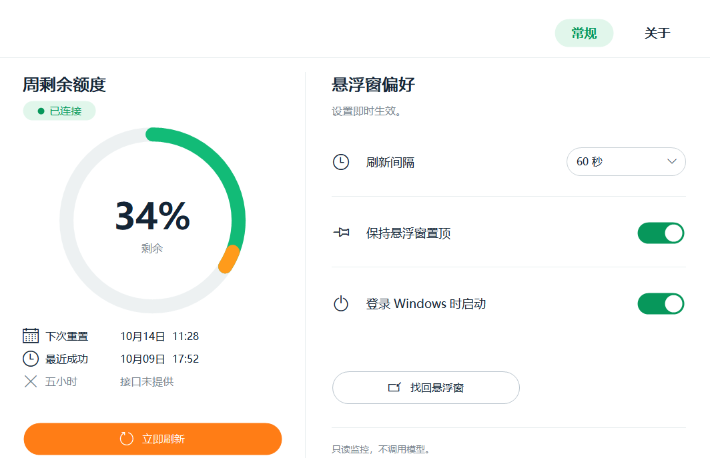
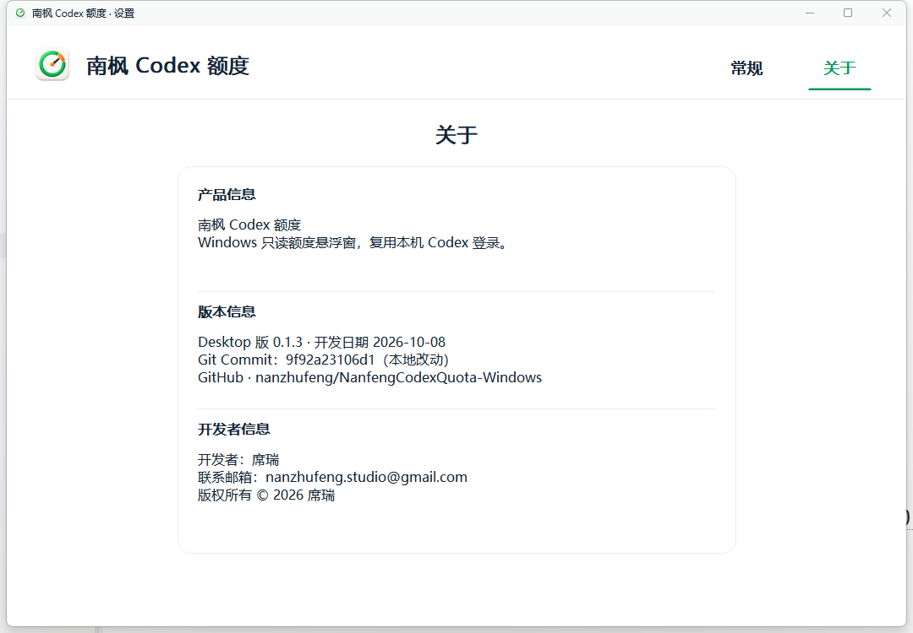

# 南枫 Codex 额度 · Windows

独立运行的只读额度悬浮窗，复用本机 Codex 登录，无需保持 Codex 主窗口打开，不创建对话或调用模型。

[下载 Windows 安装包](https://github.com/nanzhufeng/NanfengCodexQuota-Windows/releases/latest)




预览来自 v0.1.3 在 Windows 上的真实运行界面。

- 显示周剩余额度；接口提供五小时窗口时，在设置中同步列出。
- 连接失败保留最近成功值，并明确显示异常或过期状态。
- 默认每 60 秒刷新，支持手动刷新、失败退避和查询取消。
- 可拖动、保存位置、置顶、隐藏找回；支持单实例及可选开机启动。
- 白色仪表式中文设置、独立应用图标；关于页显示实际构建 Git Commit。

## 安装与使用

支持 Windows 10/11 x64。先安装并登录 Codex，再运行 Release 中的 Setup EXE。首次安装不自动启用开机启动；已有启动设置在升级时保留。

右键圆窗或托盘图标打开带图标的菜单，选择“打开主界面”；双击托盘图标也可直接打开。卸载保留本软件设置，不修改 Codex 登录数据。

**当前安装包未进行 Windows 发行签名。** 实际多屏切换、系统缩放、睡眠唤醒及长期连续运行仍需扩大验证。

## 开发

Rust 1.95.0 + Windows MSVC。源码可独立构建，不需要父项目或 WinUI、.NET、WebView2 附带运行库。

```powershell
cargo check --locked
cargo test --all-targets --locked
cargo build --release --locked
./scripts/build-release.ps1 -AllowUnsigned
```

安装包使用 Inno Setup 7。签名配置和验收边界见 [开发说明](docs/DEVELOPMENT.md)。

基于 Apache-2.0 协议，第三方来源与署名见 [NOTICE](NOTICE) 和 [LICENSE](LICENSE)。
